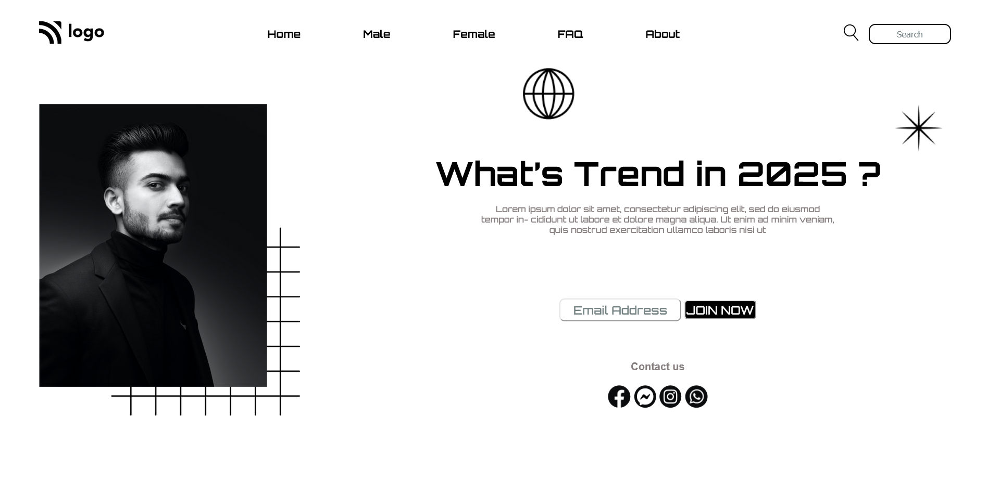

# Street Style Landing Page

## Table of contents

  - [Overview](#overview)
    - [The challenge](#the-challenge)
    - [Screenshot](#screenshot)
  - [My process](#my-process)
    - [Built with](#built-with)
    - [What I learned](#what-i-learned)
    - [Continued development](#continued-development)
    - [Useful resources](#useful-resources)
  - [Author](#author)


## Overview

### The challenge

- Adjust the images in page layout.
- Hover effect with underline style.

### Screenshot




## My process

### Built with

- Semantic HTML5 markup
- CSS custom properties like position , pseudo Selectors etc.
- Flexbox

### What I learned

- Learn how to use position with z-index .
- Learn about the alignment of elements .
- Learn about the pseudo Selectors.
  
```css
  .hero-container div img[alt="person-hero-iamge"] {
    width: 21.875rem;
    position: absolute;
    z-index: 1;
    left: 0%;
    top: 10%;
  }

```


### Continued development

- With the css pseudo selectors and positions.

### Useful resources

- [Stackoverflow](https://stackoverflow.com/) - This is a free platform where you find the solution of your problem or an idea related to your problem.


## Author

- Kapil Kharera
- Linkedin - [@kapil-kharera](https://www.linkedin.com/in/kapil-kharera-191b83245/)

